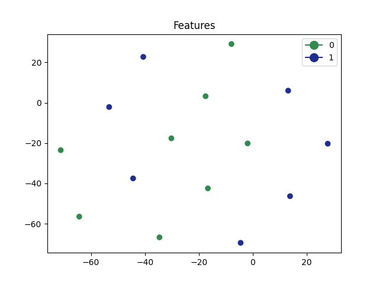

# pytorch-tools
Useful pytorch tools

# Surgery
Simple module useful to monitor intermediate layers outputs

```python
import pytorchtools as pt
import torch
import timm

model = timm.create_model("resnet50", pretrained=False)

monitor = pt.ForwardMonitor(model, verbose=False)
monitor.add_layer("global_pool.flatten", alias="features")

input = torch.rand((8, 3, 224, 224))
output = model(input)

print(monitor.get_layer("features").size())

"""
output: torch.Size([8, 2048])
"""
```

# Show features

Nice matplotlib tool to visualize 2d-dimensional (reduced) features usind t-sne, pca or umap

```python
import pytorchtools as pt
import timm
import torch
from torchvision.datasets import ImageFolder
import torchvision.transforms as T
import numpy as np

dataset_root = "dataset_for_test"

val_transform = T.Compose([T.Resize((224,224)), T.ToTensor(), T.Normalize(mean=[0.485, 0.456, 0.406], std=[0.229, 0.224, 0.225])])
dataset = ImageFolder(dataset_root, transform=val_transform)
val_loader = torch.utils.data.DataLoader(dataset, batch_size=32, shuffle=False)

model = timm.create_model("resnet50", pretrained=False)

features = pt.cls_inference_embedding(model, val_loader, "global_pool.flatten", image_index=0, device="cuda")

paths, labels = zip(*dataset.samples)

pt.show_features(features, labels, method="tsne", perplexity=15, path_images=paths)
```

This will show a matplotlib figure with clickable feature points (when click it shows the relaive image)

